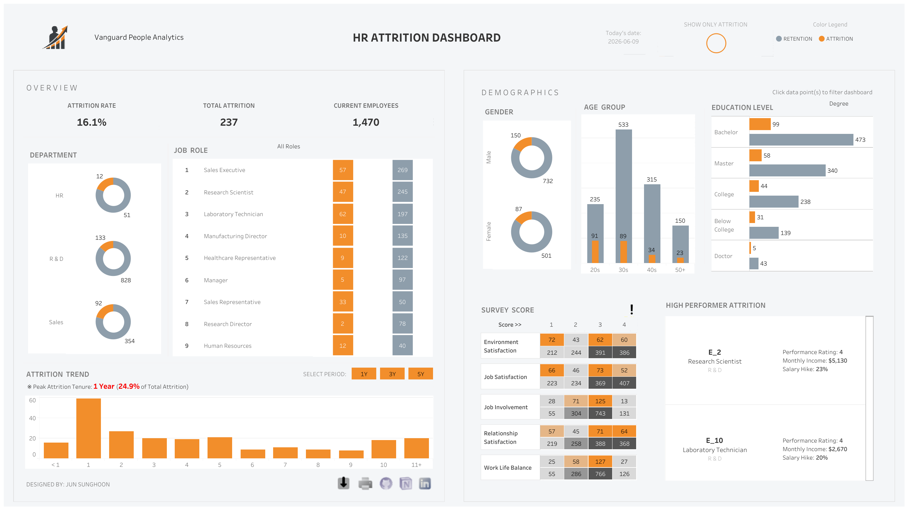

# HR-ATTRITION-ANALYTICS — Tableau 포트폴리오

> HR 애널리틱스를 위한 고급 Tableau BI 솔루션. 파라미터 기반 동적 뷰, 셋 액션(Set Action),
> 코호트 분석을 활용해 핵심 인재(고성과자) 이탈과 인력 이탈 추세를 진단합니다.


---

## 🎯 프로젝트 개요

본 포트폴리오는 전략적 HR 조직의 분석 워크플로우를 재구성한 것으로, 인재 유지(Retention)를 위한 실행 가능한 인사이트 도출에 초점을 맞췄습니다. 
Tableau로 구축된 대시보드는 인력 이탈 현상을 심층 분석하며, 시니어 데이터 분석가의 핵심 업무(JD)를 직접적으로 다룹니다.

| 대시보드 | 담당 업무 (JD) | 도출하는 핵심 질문 |
|---|---|---|
| 1. 경영진 이탈 현황 (Executive Overview) | 경영진 리포팅 및 분석 | 전체 이탈률은 얼마이며, 어느 부서가 위험한가? |
| 2. 인구통계 심층 분석 (Demographic Deep Dive) | 인력 다양성 분석 | 연령, 성별, 학력은 직원 이탈에 어떤 영향을 미치는가? |
| 3. 몰입도 상관관계 (Engagement Correlation) | 직원 설문 분석 | 어떤 만족도 지표가 직원 이탈과 강하게 연관되는가? |
| 4. 핵심 인재 심층 분석 (Talent Insights Deep Dive) | 인재 유지 전략 | 경쟁력 없는 보상 때문에 최상위 인재를 잃고 있는가? |

---

## 🛠 기술 스택 (Tech Stack)

- 데이터 모델 — BI 활용에 최적화되도록 정규화한 플랫(Flat) HR 데이터셋
- Tableau Desktop 2024.1 — 관계(Relationship) 기반 데이터 모델링, LOD 표현식, 계산된 필드(Calculated Field)
- UI/UX 디자인 — 고급 패딩 구조(카드 UI), 커스텀 타이포그래피 정렬(간트 정렬 기반 텍스트 테이블)

---

## 📊 대시보드: HR 이탈 분석 대시보드

대상: CHRO, HR 임원진



### 핵심 인사이트 (Key Insights)
- 전체 이탈률 16.1% (전체 1,470명 중 237명 자발적 퇴사).
- 이탈 집중 구간: 전체 이탈의 24.9% 가 근속 1년 차에 집중 발생 → 초기 근속자 유지 프로그램의 결정적 공백을 시사.
- 직무별 위험도: 영업 담당(Sales Executive)과 연구실 기술직(Laboratory Technician) 에서 이탈 규모가 가장 높음.
- 몰입도 요인: 환경 만족도와 업무 몰입도에서 1점을 기록한 직원이 전체 이탈에서 큰 비중을 차지.
- 고성과자 이탈 위험: 인사평가 4점을 받은 R&D 연구원이 20% 이상의 급여 인상에도 불구하고 퇴사하는 critical 케이스 식별.

### 💡 실행 권고안 (전략적 다음 단계)

진단 인사이트를 바탕으로, 경영진에게 다음과 같은 데이터 기반 개입(intervention)을 권고합니다.

* '1년 차' 타깃 리텐션 프로그램: 이탈의 24.9%가 1년 차에 정점을 찍는 만큼, HR은 입사 후 3·6·9개월 시점에 선제적 마일스톤 점검(체크인)을 도입하고, 온보딩 정합성과 초기 커리어 경로 설계에 집중해야 합니다.
* R&D 핵심 인재 보상 재정렬: R&D 고성과자(평가 4점 이상)의 이탈 위험은 현재의 급여 인상(20%에도 불구하고)이 시장 임금 수준에 뒤처져 있음을 시사합니다. 즉각적인 보상 벤치마크 검토와 상위 25% 엔지니어 대상 타깃 리텐션 보너스를 권고합니다.
* 근무 환경 개입: 환경 만족도 '1점' 직원을 대상으로 즉시 포커스 그룹을 구성해 구체적 불만 요인(예: 원격근무 유연성, 시설 환경)을 파악하고, 즉각적인 이탈을 막기 위한 퀵윈(quick-win) 개선책을 배포합니다.

### 구성 요소 (Components)
- KPI 카드 3종 (이탈률, 총 이탈자 수, 현재 재직자 수)
- 인구통계 토글: 도넛 차트(성별), 막대 차트(연령·학력) — 파라미터 기반 차원 전환(Dimension Swap)
- 히트맵: 설문 점수 vs. 이탈 규모 상관관계
- 간트 정렬 텍스트 테이블: 고성과자 이탈 상세 리스트

---

## 🗂️ 논리적 데이터 모델 (Logical Data Model)

전통적인 스타 스키마와 달리, 본 프로젝트는 빠른 BI 활용과 추출(Extract) 성능에 최적화된 비정규화 플랫 파일 아키텍처를 사용합니다. 데이터셋(`약 1.5K 행, 35개 컬럼`)은 네 개의 분석 도메인으로 논리적으로 분할됩니다.

```
[ WA_Fn-UseC_-HR-Employee-Attrition.csv ]
│
├── 🧑‍🤝‍🧑 인구통계 (Demographics)
│ ├── Age, Gender
│ └── Education_Level, Education_Field
│
├── 🏢 직무 정보 (Job Information)
│ ├── Department, Job_Role, Job_Level
│ ├── Years_At_Company, Years_In_Current_Role
│ └── Monthly_Income, Percent_Salary_Hike
│
├── 📊 설문 및 성과 (Survey & Performance)
│ ├── Environment_Satisfaction  # 환경 만족도 (1-4)
│ ├── Job_Satisfaction          # 직무 만족도 (1-4)
│ ├── Job_Involvement           # 업무 몰입도 (1-4)
│ ├── Relationship_Satisfaction # 관계 만족도 (1-4)
│ ├── Work_Life_Balance         # 워라밸 (1-4)
│ └── Performance_Rating        # 인사평가 등급 (3-4)
│
└── 🎯 타깃 변수 (Target Variable)
  └── Attrition (Yes / No) # 이탈 여부
```


---

## 📁 저장소 구조 (Repository Structure)

```
HR-ATTRITION-ANALYTICS/
├── README.md                               # 프로젝트 개요 및 실행 가이드 (ENG)
├── README_KR.md                            # 프로젝트 개요 및 실행 가이드 (KOR)
├── SQL                                     # 데이터 파이프라인 SQL 스크립트
│ ├── hr_pipeline_en.sql                    # ETL 파이프라인 (영문 주석)
│ └── hr_pipeline_ko.sql                    # ETL 파이프라인 (국문 주석)
├── data/
│ └── WA_Fn-UseC_-HR-Employee-Attrition.csv # 원본 데이터
│ └── hr_attrition_mart.csv.xlsx            # 정제·가공 데이터 (마트 추출본)
├── tableau/
│ └── hr_attrition_dashboard.twbx           # 패키지 Tableau 워크북
└── screenshots/                            # 대시보드 스크린샷
  └── overview.png
```


---

## 🎨 디자인 원칙 (Design Principles)

본 포트폴리오는 다음의 디자인 철학을 따릅니다.

- UI 아키텍처 — #F4F6F8 배경 위에 #FFFFFF 플로팅 컨테이너를 배치하고, 4-8px 외부 패딩을 계산해 적용.
- 시각적 위계 — 상단에 KPI 숫자를 지배적으로 배치하고, 고대비 섹션 헤더(예: O V E R V I E W)로 보조.
- 컬러 — 강렬한 오렌지(#F28E2B)는 오직 타깃 지표(이탈)에만 사용하고, 나머지는 중립적인 슬레이트 그레이로 처리.
- 타이포그래피 — Tableau Book / Tableau Semibold / Tableau Bold

---

## 📌 핵심 계산된 필드 (Tableau)

본 대시보드는 동적 뷰 전반에서 정확한 집계를 유지하기 위해 LOD(Level of Detail) 표현식과 고급 테이블 계산(Advanced Table Calculation)을 적극 활용합니다.

```
// 1. Dynamic Tenure X-Axis [Parameter-Driven Grouping]
// 사용자 선택(1년/3년/5년)에 따라 x축의 세분도(granularity)를 동적으로 변경
IF [Toggle - Tenure Bin] = 1 THEN
    IF [Years At Company] = 0 THEN '< 1'
    ELSEIF [Years At Company] = 1 THEN '1'
    ELSEIF [Years At Company] >= 11 THEN '11+'
    ELSE STR([Years At Company]) END
ELSEIF [Toggle - Tenure Bin] = 3 THEN
    IF [Years At Company] >= 12 THEN '12+'
    ELSE STR(INT([Years At Company]/3) * 3) + ' ~ ' + STR(INT([Years At Company]/3) * 3 + 2) END
ELSEIF [Toggle - Tenure Bin] = 5 THEN
    IF [Years At Company] >= 15 THEN '15+ '
    ELSE STR(INT([Years At Company]/5) * 5) + ' ~ ' + STR(INT([Years At Company]/5) * 5 + 4) END
END

// 2. Attrition Count per Bin [FIXED LOD]
// 동적으로 생성된 근속 구간(bin)에 고정하여 총 이탈 수를 계산
{ FIXED [Dynamic Tenure X-Axis] : SUM([Is Attrition]) }

// 3. Max Attrition Count [Nested LOD]
// 이탈 정점(peak) 값을 식별해 축 범위를 동적으로 조정하거나 하이라이트를 트리거
{ MAX([Attrition Count per Bin]) }

// 4. Attrition Rate % [EXCLUDE LOD]
// 이탈 상태로 필터링하더라도 분모(전체 직원 수)가 변하지 않도록 고정
SUM(IF [Attrition] = 'Yes' THEN 1 ELSE 0 END) 
/ 
MIN({ EXCLUDE [Attrition] : COUNTD([Employee Number]) })

// 5. Color Intensity Normalization [Advanced Table Calculation]
// 이탈(0 ~ 1)과 재직(0 ~ -1)의 색상 그라데이션을 각각 독립적으로 정규화
IF MIN([Switch Attrition/Retention 2]) = 'Attrition employees' THEN
    (COUNTD([Employee Number]) - WINDOW_MIN(COUNTD([Employee Number])))
    / 
    (WINDOW_MAX(COUNTD([Employee Number])) - WINDOW_MIN(COUNTD([Employee Number])))

ELSEIF MIN([Switch Attrition/Retention 2]) = 'Current employees' THEN
    - ( (COUNTD([Employee Number]) - WINDOW_MIN(COUNTD([Employee Number])))
    / 
    (WINDOW_MAX(COUNTD([Employee Number])) - WINDOW_MIN(COUNTD([Employee Number]))) )
ELSE 
    0
END
```


---

## 📬 연락처 (Contact)

[전성훈 (Sunghoon Jun)] — 데이터 분석가
- 📧 trixar17@gmail.com
- 💼 [LinkedIn](https://www.linkedin.com/in/trixar17)
- 📊 [Tableau Public](https://public.tableau.com/app/profile/sunghoon.jun)
- 🧾 [Notion](https://app.notion.com/p/HR-Attrition-Analytics-Tableau-Portfolio-EN-37ab35986d79818c8fe8e91d193172a2)

---

## 📄 라이선스 (License)

본 프로젝트는 합성 데이터(synthetic data)만 사용하며, 포트폴리오 목적으로 제작되었습니다.
